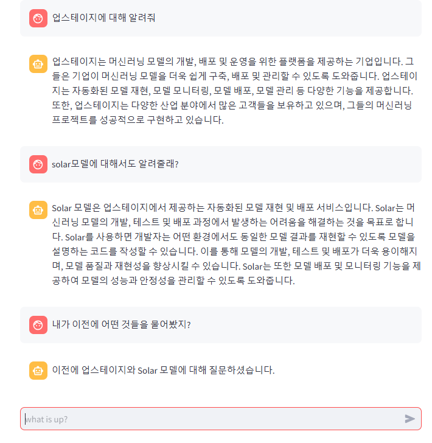

# streamlit_chat

streamlit을 활용해 간단하게 만든 챗봇 코드

Upstage의 solar-pro 모델과 langchain_upstage를 활용해 챗봇을 구현했고, 해당 코드는 이후 langchain과 RAG 학습을 위한 코드이다.

### 실행 방법   
가상환경을 생성한 후  

```bash
pip install streamlit langchain_upstage
streamlit run main.py
```

### 실행 화면
  
